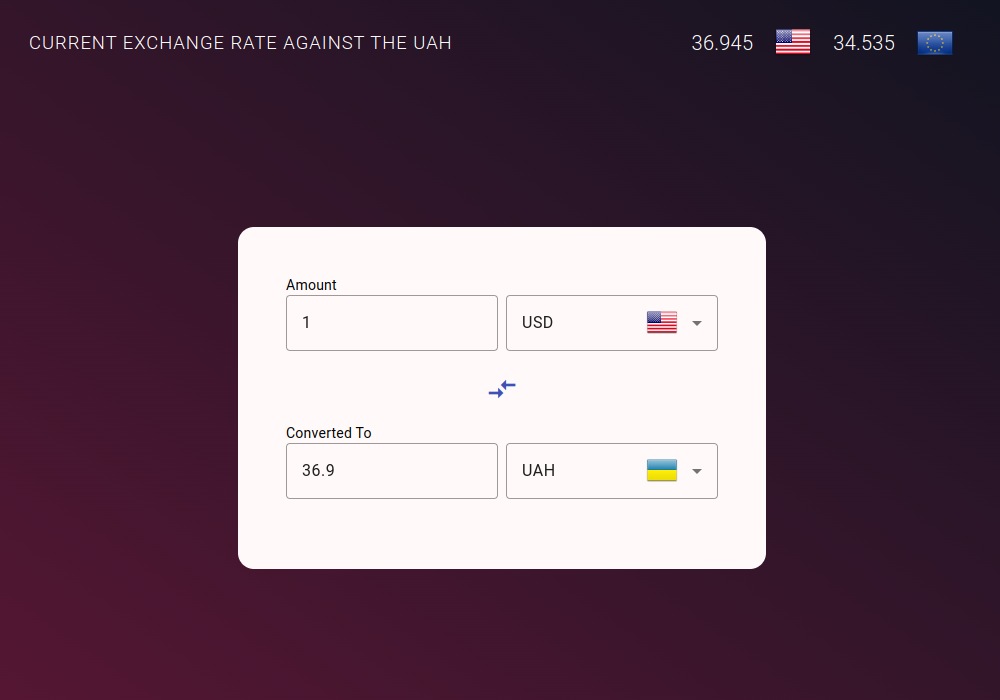

# Currency Xchange

A simple currency converter application built with Angular.

## Demo

You can try out the live demo of the Currency Converter [here](https://aleksandr-onopriyenko.github.io/currency-xchange/).

## Features

- Convert between different currencies in real-time.
- Fetches currency exchange rates from a free API.
- Supports a twelve ranges of currencies.
